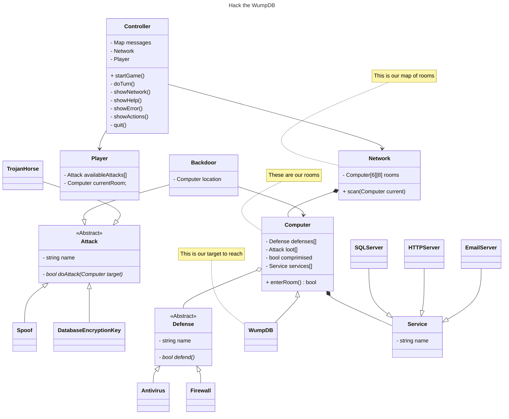

# Authors

Patrick Rafferty & Mazen Hamid & Tyler Schreiber

# URL

https://github.com/xdazld/csc-2210--spa-4--wumpus-hunt.git

# Help

Welcome to "Hack the WumpDB"
The WumpDB resides in a network of 60 computers. Each computer has 1 to 4 network connections
leading to other computers. (Look at a rectangular maze to see how this works - if you don't know
what a rectangular maze is, ask someone).

## Hazards:

* Anti Virus
* Firewall

## WumpDB:

The WumpDB is well protected and is usually not moved to different computers. Attempting to connect
to the WumpDB without having proper permissions to access it will cause it to blacklist your IP
address, meaning you lose.

## You

Each turn you can attack an adjacent computer to allow lateral movement to that computer or perform
the lateral movement.
You can move across one network connection at a time. If you successfully move to the computer with
the WumpDB, you win. You will automatically do some scanning when you connect to a computer.
You attack by telling the game which direction on the network you want to attack. If you manage to
attack your local host, you will lose. However, if you connect to a computer will a firewall, all
your spoof attacks will be removed.
Connecting to a computer with antivirus installed will cause your attack to be found out and you
will be removed from the network.
When exploring network you can find three different tools to help you. An encryption key will allow
you to decode the encryption on the WumpDB and gain access to the database without getting
blacklisted, allowing you to win the game. You can also find source code for spoofing attacks in the
network, using a spoofing attack will allow you to remove firewalls and antiviruses from an adjacent
computer. Finally, you can find backdoors that will let you return back to the location you found it
when used.

## Scanning

When you are one connection away from a WumpDB or hazard, the game will say:

* WumpDB: This device has a database administration tool installed.
* Antivirus: Unauthorized Activity Detected
* Firewall: A connected device is not responding to scans.

# Map

* `.`: An empty space
* `+`: The Player (Only One)
* `?`: Spoofing Source Code (Random)
* `?`: Backdoor (Random)
* `?`: Encryption Key (Only One)
* `@`: Firewall (Random)
* `!`: Antivirus (Random)
* `#`: WumpDB (Only One)

```text
. ? . . . @ . .
@ ! . ? . . ? .
? . .     . ? .
? . .     ? . .
. ! . . @ # . .
+ ? ? . ! . . @
```

# UML Class Diagram



# Code Owners

## Patrick

* Attack class and its concrete implementations Spoof, Database Encryption Key, and Backdoor.
* Defense class and its concrete implementations Antivirus and Firewall.
* Services class and its concrete implementations HTTP, SQL, and Email.

## Mazen

* The Network, the computer that comprise it, and WumpDB.

## Tyler

* The Player class.
* The Controller class; handling the game state and player input and game output.

# Unique About Solution

Our solution takes inspiration from the [MITRE ATT&CK Framework](https://attack.mitre.org/), a
subject some of our group has worked on in our Introduction to Cybersecurity Principles course.
It also takes some minor inspiration from [Hacknet](https://en.wikipedia.org/wiki/Hacknet).

# Building

## Debug Mode

## Versions of Software Used

CMake: 3.29.6

Build Tool: ninja 1.12.0

C Compiler: gcc 13.1.0

C++ Compiler: g++ 13.1.0

Debugger: GDB 14.2
