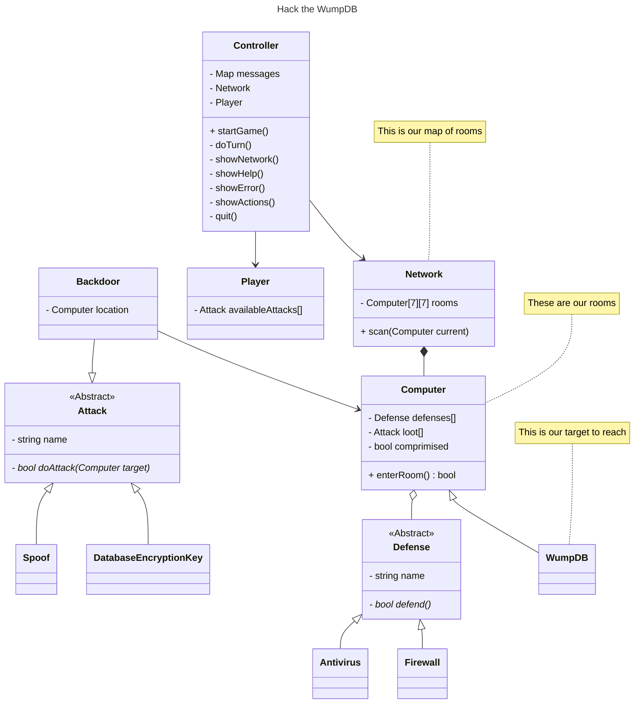

# Authors

Patrick Rafferty & Mazen Hamid & Tyler Schreiber

# URL

https://github.com/xDazld/csc-2210--spa-4--wumpus-hunt

# Help

Welcome to "Hack the WumpDB"
The WumpDB resides in a network of 60 computers. Each computer has 1 to 4 network connections
leading to other computers. (Look at a rectangular maze to see how this works - if you don't know
what a rectangular maze is, ask someone).

## Hazards:

* Anti Virus
* Firewall

## WumpDB:

The WumpDB is well protected and is usually not moved to different computers.

## You

Each turn you can attack an adjacent computer to allow lateral movement to that computer or perform
the lateral movement.
You can move across one network connection at a time. If you successfully move to the computer with
the WumpDB, you win. You will automatically do some scanning when you connect to a computer.
You attack by telling the game which direction on the network you want to attack. If you manage to
attack your local host, you will lose.

## Scanning

When you are one connection away from a WumpDB or hazard, the game will say:

* WumpDB: This device has a database administration tool installed.

# Map

# UML Class Diagram

# Code Owners

## Patrick

## Mazen

## Tyler

# Unique About Solution

Our solution takes inspiration from the [MITRE ATT&CK Framework](https://attack.mitre.org/), a
subject some of our group has worked on in our Introduction to Cybersecurity Principles course.

# Building

## Debug Mode

## Versions of Software Used

CMake: 3.29.6

Build Tool: ninja 1.12.0

C Compiler: gcc 13.1.0

C++ Compiler: g++ 13.1.0

Debugger: GDB 14.2
